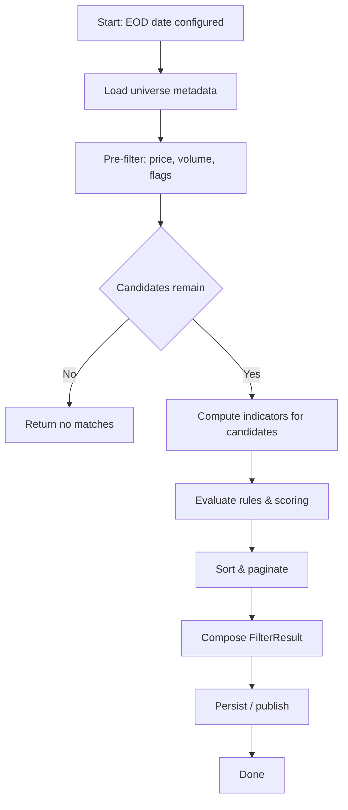

# EOD Scanner — FilterStocks

## Purpose

This document describes the FilterStocks function used to run an end-of-day (EOD) stock scanner. It explains the inputs, outputs, algorithm, rules, examples, and integration notes so engineers can implement, test, and operate the scanner.

---

## Function signature (suggested)

```csharp
// synchronous
FilterResult FilterStocks(IEnumerable<Candle> eodHistory, FilterCriteria criteria, DateTime eodDate, CancellationToken ct = default);

// async
Task<FilterResult> FilterStocksAsync(IEnumerable<Candle> eodHistory, FilterCriteria criteria, DateTime eodDate, CancellationToken ct = default);
```

---

## Data types

| Type | Field | Description |
|---|---:|---|
| Candle | Timestamp | Date/time of the candle (UTC preferred) |
|  | Open, High, Low, Close | Prices (decimal) |
|  | Volume | Volume (long) |
|  | AdjClose? | Optional adjusted close for corporate actions |

| FilterCriteria | EodDate | Date to evaluate (must match available candles) |
|  | LookbackDays | Days of history used for indicators (e.g., 50) |
|  | MinPrice / MaxPrice | Price range filter |
|  | MinAvgVolume | Minimum average volume over lookback |
|  | MovingAverageCriteria | Window, Type (SMA/EMA), Direction, CompareTo |
|  | IndicatorCriteria | RSI, MACD, ATR etc. with thresholds |
|  | ExcludeFlags | Delisted, Halted, OTC, etc. |
|  | ScoringRules | Optional weights for scoring different rules |

| FilterResult | Matches | IReadOnlyList<StockMatch> (detailed results) |
|  | TotalScanned | Number scanned |
|  | TotalMatched | Number matched |
|  | Duration | Scan runtime |
|  | Diagnostics | Per-step timings, errors |

| StockMatch | Ticker | Symbol |
|  | IsMatch | bool indicating pass/fail |
|  | Score | Combined score (if scoring used) |
|  | Reasons | Human-friendly reasons for inclusion/exclusion |
|  | Metrics | Key numeric metrics used in decision-making |
|  | Rank | Rank after sorting (if applicable) |

---

## High-level algorithm

1. Input validation: validate criteria and ensure sufficient history exists for requested indicators.
2. Pre-filter: apply cheap filters first (price range, delisted/halted, estimated avg volume) to reduce candidate set.
3. Indicator computation: compute SMA/EMA, RSI, MACD, ATR, stddev, and volume averages only for candidates.
4. Rule evaluation: evaluate criteria in order of low-cost/high-rejection first; short-circuit when strict rules fail.
5. Scoring & ranking: if enabled, compute normalized per-rule scores and combine according to weights. Sort results.
6. Result composition: produce FilterResult with StockMatch entries including Reasons and Metrics.

---

## Rule semantics (examples)

| Rule | Semantics / Example |
|---|---|
| Price range | Close on EOD date between MinPrice and MaxPrice |
| Liquidity | Avg volume over LookbackDays >= MinAvgVolume |
| SMA crossover | Close > SMA(50) and SMA(50) > SMA(200) indicates uptrend |
| Momentum | Close > Close(N days ago) * (1 + X%) or MACD histogram > 0 |
| Volatility limit | ATR(14) / Close <= MaxATRPercent |
| RSI bounds | RSI(14) between Min and Max (e.g., 30..70) |
| Gap filter | (Open - PrevClose) / PrevClose >= MinGapPercent |

---

## Pre-filter vs Indicator cost ordering

Use this ordering to minimize work per ticker:

- Basic flags and metadata checks (delisted, halted)
- Price range and quick volume estimates (rolling average cached)
- Volatility and ATR approximations
- Full indicator computation (SMA/EMA, RSI, MACD)

---

## Example scoring scheme (table)

| Rule | Weight | Pass contribution |
|---:|---:|---:|
| Avg volume >= threshold | 2 | +2 |
| Close > SMA(50) | 3 | +3 |
| RSI in 30..60 | 1 | +1 |
| ATR% <= 5% | 1 | +1 |
| Gap up >= 2% | 2 | +2 |

Total possible: 9 — normalize as needed.

---

## Flow diagram (Mermaid)



> Note: Mermaid blocks render on platforms that support mermaid. If your target viewer doesn't render mermaid, the flowchart still documents the logical flow.

---

## Example filter configuration (YAML-style)

```yaml
EodDate: 2026-01-15
LookbackDays: 200
MinPrice: 5
MaxPrice: 200
MinAvgVolume: 100000
MovingAverageCriteria:
  - Window: 50
	Type: SMA
	Direction: Above
  - Window: 200
	Type: SMA
RSI:
  Window: 14
  Min: 30
  Max: 70
ScoringRules:
  Weights:
	AvgVolume: 2
	SMA50: 3
	RSI: 1
MaxResults: 100
```

---

## Sample metrics table (per-match)

| Ticker | Close | SMA20 | SMA50 | RSI14 | AvgVol50 | ATR14 | Score | Reasons |
|---|---:|---:|---:|---:|---:|---:|---:|---|
| ABC | 24.13 | 22.5 | 20.2 | 48.5 | 210000 | 0.87 | 8.0 | "SMA50 up, vol ok" |

---

## Data & timezone considerations

- Normalize candles to UTC to avoid cross-day ambiguity.
- For international tickers, consider currency normalization before applying price thresholds.
- If no candles exist for eodDate, return explicit error or an empty result indicating holiday/no-trade.

---

## Performance & implementation notes

- Complexity: O(M * N) where M = tickers scanned, N = lookback days. Reduce by pre-filtering and caching.
- Compute multiple indicators in a single pass where feasible.
- Parallelize ticker evaluation but bound degree of parallelism to avoid I/O/CPU saturation.
- Cache commonly used indicator windows across runs (e.g., SMA(50)) for reuse.

---

## Error handling

- Mark stock as skipped with reason "insufficient-data" when history is too short.
- Catch per-ticker exceptions, log, and continue scanning.
- Validate FilterCriteria at entry and throw ArgumentException for invalid ranges.

---

## Testing recommendations

- Unit tests for each rule with synthetic candles.
- Integration test with historical dataset to validate expected matches.
- Performance test scanning the full universe with concurrency limits.

---

## Integration points

- Run as a scheduled BackgroundService (hosted worker) after EOD data ingestion.
- Persist FilterResult for audit trails and reproducibility.
- Expose a dry-run mode and a verbose mode with full per-rule diagnostics.

---

## Observability

- Log counts: scanned, pre-filtered-out, matched, failed-by-rule.
- Emit per-run timings: total, pre-filter, indicators, scoring.
- Include Reasons and Metrics in the output to allow explainability.

---

## Security & governance

- Validate criteria to avoid risk when integrating with execution systems.
- Apply rate limits to calls against third-party data APIs.

---

## Appendix: C# Candle and model skeleton

```csharp
public record Candle(DateTime Timestamp, decimal Open, decimal High, decimal Low, decimal Close, long Volume, decimal? AdjClose = null);

public class FilterCriteria { /* fields as described above */ }

public class FilterResult { /* fields as described above */ }

public class StockMatch { /* fields as described above */ }
```

---

If you want I can:

- generate a C# implementation skeleton (service + core loop),
- add unit test templates for key rules, or
- include an example CSV export and a small sample dataset with example outputs.
